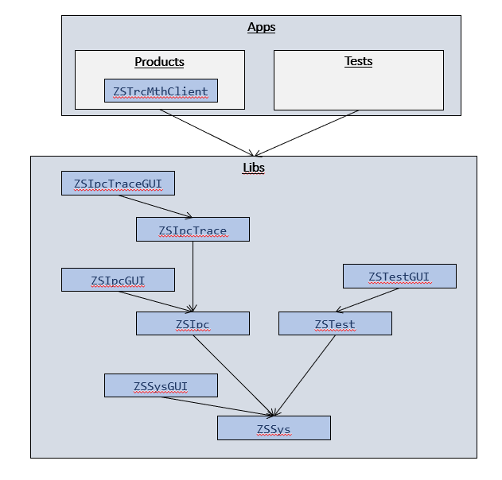

# ZSQtLib

Welcome to the user guide of the ZSQtLib.
The user guide provides you with an introduction and overview of the modules within this framework.

ZSQtLib is a C++ class library based on Qt.

The class library provides you with classes which may help you to realize your C++ projects.

The classes are logically organized in namespace packages. The packages are deployed as Dlls.
For most of the packages two Dlls are provided. One Dll summarizes all classes building up the
logical application or model layer without any GUI components (without any viewer functionality).
Another Dll provides the viewer classes which may be used to control the application layer
classes or indicate the content of the data model classes.

- [Build Instructions](Doc/mainBuildInstructions.md)
- [Coding Guidelines](Doc/mainCodingGuidelines.md)
- [Enumerations](Doc/mainEnumerations.md)
- [Error Handling](Doc/mainErrorHandling.md)
- [Index Tree](Doc/mainIndexTree.md)
- [MemLeakDetection](Doc/mainMemLeakDetection.md)
- [Method Tracing](Doc/mainMethodTracing.md)
